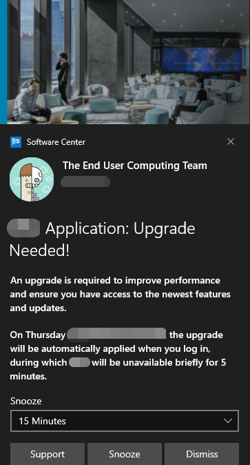

# EndUserExperience

These are scripts that clean up the desktop UI for corporate users

## ConfigureSymphony.ps1

**Overview** This is a simple script that puts together the base configuration file for a finance-focused instant messenger entitled *Symphony.* This was a good exercise on learning how to create a powershell object that can be quickly converted to the json configuration file required by this application.

## ConfigureWriteFilter.ps1

**Overview** This script works in tandem with *EnableKioskMode.ps1* to create, what I'd call a *poor man's* kiosk for a cost-effective way to recycle existing assets into thin clients for VDI applications. I found it necessary, in past organizations, to go this route when the bulk of the environment has traditionally purchased relatively good computers and would be considered unreasonable to usher in thin clients to replace systems that are still under warranty.

This particular script will install and enable the **Universal Write Filter** on Windows 10 devices. This works well with Microsoft's Endpoint Configuration Manager Endpoint. Note: One of the action items remaining is a paramater switch that can be used to effectively disable/uninstall the filter - it is a nice to have when testing this in a lab environment.

## EnableKioskMode.ps1 and DisableKioskMode.ps1

**Overview** These two (2) scripts work together - they are also Microsoft Endpoint Configuration Manager compatible - to create browser-based kiosks to, say, point machines to a corporate VDI portal or as hotel-like kiosks for general browsing. These scripts work well together with the *ConfigureWriteFilter.ps1* script.

## DisableBingInSearch.ps1 and Mycomputericon.ps1

**Overview** This are simple scripts with big positive UX impact in corporate settings that allowed me to begin teaching Level-2 support personnel how easily you can use PowerShell to improve the end user experience. These scripts are extractions of larger scripts used with Microsoft's Endpoint Configuration Manager in the form of CI's within a Configuration Baseline and in place of traditional GPOs.

## New-Toast.ps1

**Overview** This was probably one of the more interesting things I have worked on recently because it was a reasonable ask from a development team for a real *sticking point* to our users: application upgrades were entirely dependent on the users being logged in, but the disruption experienced (the application would be forcibly closed unexpectedly) during production hours was *inconvenient* to put it mildly. Thus this script was birthed to serve as an early "warning" system that leverages the operating system's built-in toast notification functionality to alert users of an impending upgrade.

## SchedTaskBasedPopup.ps1

**Overview** This particular script was to showcase how we can *still* leverage VBScript's popup boxes in a pinch without having to actually write VBScript code within some of the newer configuration management platforms (i.e., InTune, MECM, Ivanti's EPM, etc.). The task scheduling component uses the native PowerShell job scheduler and it was just a neat way to avoid having to use the operating system's *schtasks.exe* command-line executable, which has differeed from build to build.

## Schedule-Task.ps1

**Overview** This script was just to demonstrate how we can leverage OS executables and handle the exit code within powershell, to then pass back to something like Microsoft's Configuration Manager.

## SendInvitation.ps1

**Overview** I have noticed in past employment that, at times, there isn't a convenient way to shadow a user's session and get to the bottom of the issue being raised. This script, when packaged and installed, can sit in the user's start menu and upon clicking the script will:

* create a file-based, and password protected, Remote Assistance invitation
* launch Outlook, if it has not already been launched.
* compose a new memo
* attach the RA invitation file to the memo
* Pre-fill the body of this new memo with the password
* Pre-fill the *To* header with the distribution list associated with the level-2 support team that usually handles issues.

**Note:** This script must be launched using PowerShell (x86) and also packaged exclusive as a 32-bit package due to the heavy use of COM Objects.

## SetCustomStartMenu.ps1

**Overview** A demonstration on how to embed the start menu layout xml into the powershell script, save it to the machine's local drive, and enable the registry settings that will re-configure the start menu with a *partial* lockdown. This is a good way to *advertise* company shortcuts, in-house applications, etc.

## StartSlack.ps1

**Overview** This script *pauses* slack until a firm's security stack has loaded and allows traffic to Slack's cloud/broker servers.

## StartVNCUserMode.ps1

**Overview** While everyone knows how to install and configure VNC in SYSTEM mode, I couldn't find anyone that understood the need for user mode. User mode is vital for those users that are connecting into their desktops through RDP and get assigned a session ID other than 0 (i.e., console mode). Having this script packaged and added (as a shortcut) to users' Start Menu startup folder will run VNC Server under that user's logon token on a port beginning on 5500, permitting multiple instances of VNC Viewer on, say, a Remote Desktop Session Host (i.e., RDSH) server.

## Win11-TaskBarSettings.ps1

**Overview** This is an attempt to begin compiling the user customizations typically required in a Windows 11 enterprise environment. Most organizations will *not* be leveraging the on-frills Team chat application; Most enterprise organizations will also be *upgrading* from Windows 10 where the Start Menu is left-aligned. The center-aligned Start is an attempt to mimic and woo mobile operating system users as well as the macOS audience on the consumer end of the spectrum. Then there is also the checkered past we have all experienced with Microsoft's widgets - they were huge vulnerability and exploit vectors that enterprises simply disabled to mitigate.
